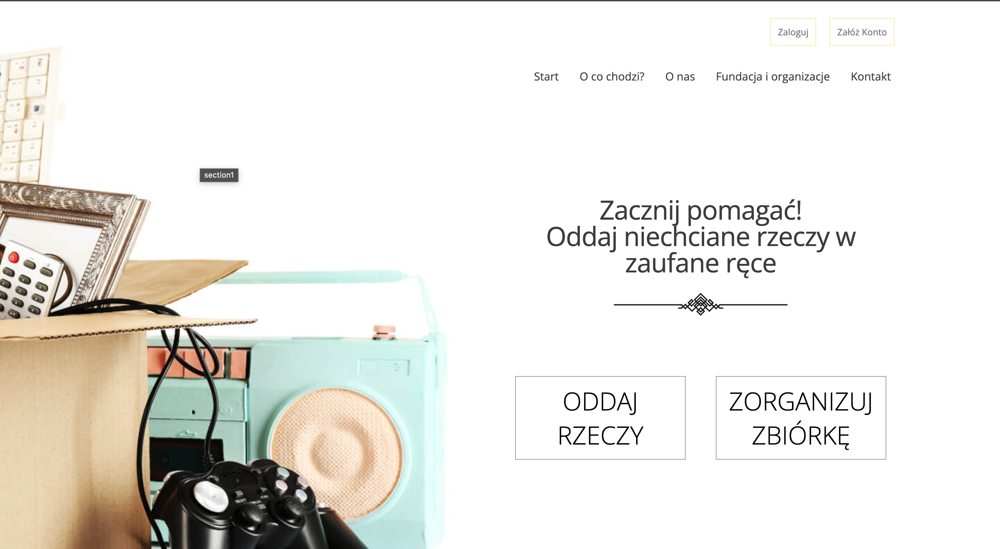
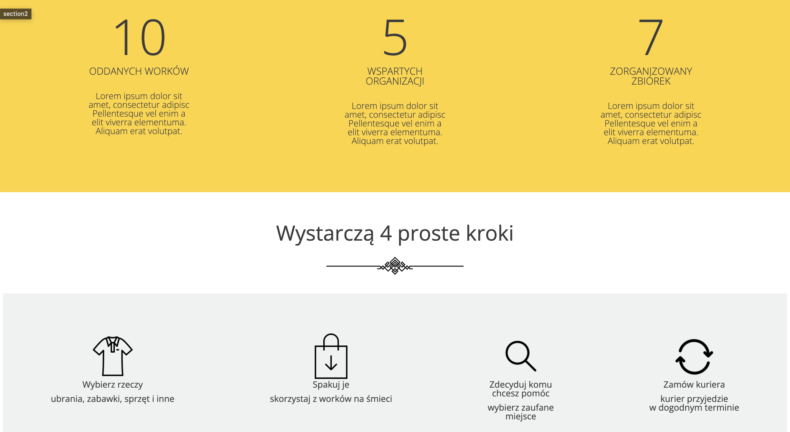
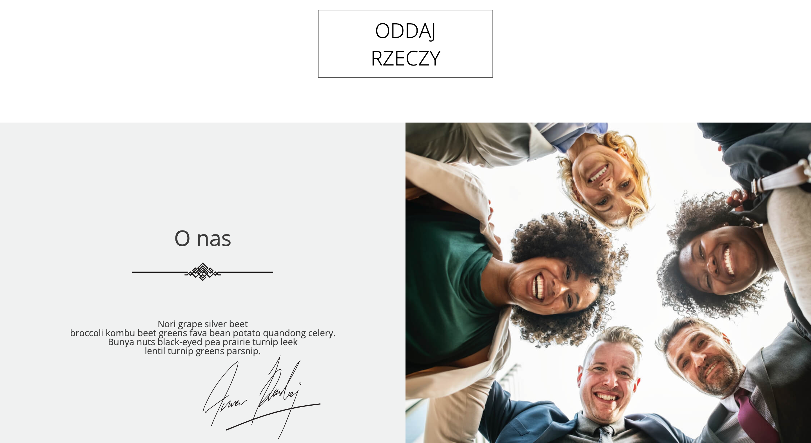
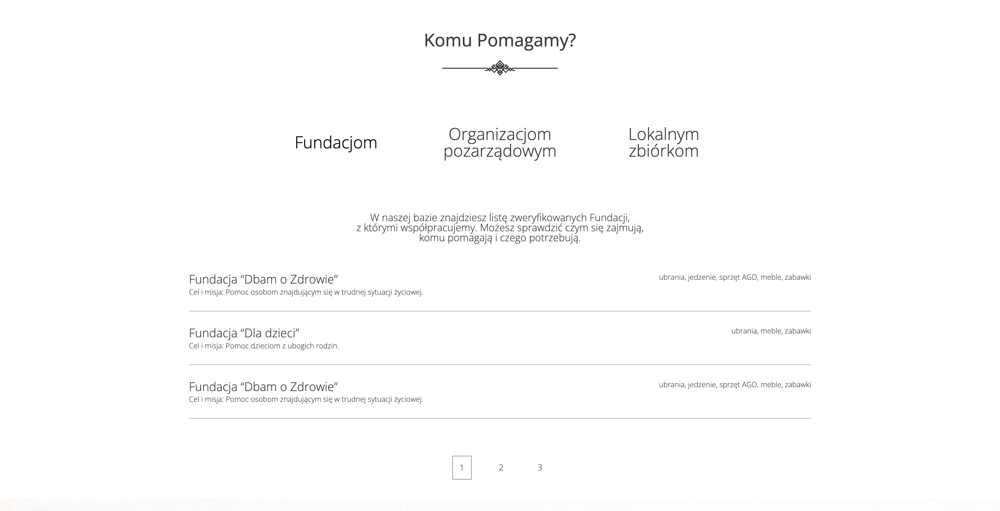

# To Good Hands

To Good Hands is a web site where you can give away your old un used stuffs!

with [Create React App](https://github.com/facebook/create-react-app).

# Table of Contents

* [General Info](#general-info)
* [Technologies Used](#technologies-used)
* [Screenshots](#screenshots)
* [Setup](#setup)
* [Project Status](#project-status)
* [Room for Improvement](#room-for-improvement)
* [Contact](#contact)

## General info

* Project created in Coders Lab bootcamp

## Technologies Used

* React
* React Router
* React Scroll
* Bootstrap
* JSON server
* HTML
* SCSS
* JavaScript

## Screenshots

Main

Steps section

About Us

Who We Help

Contact

## Setup

* Download or clone repository / git clone repo_address
* Install dependencies / npm install
* Install JSON sevrer / npm install -g json-server
* Start JSON server on database file by json-server --watch db.json
* Start app by npm start

## Room for Improvement

* create form for given stuffs
* responsive view

## Contact

Project Created by [Michał Mardosz](https://www.linkedin.com/in/micha%C5%82-mardosz-298892228/) 